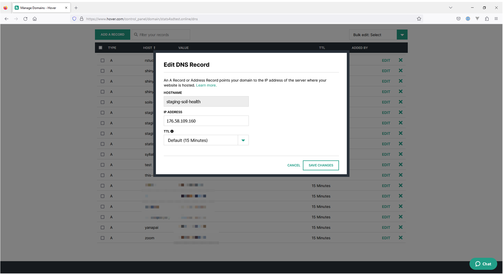

# Create New Subdomain in Hover

This document illustrates how to create a new subdomain under an existing domain name.
E.g., Create a new subdomain “staging-soil-health” under an existing domain name “stats4sdtest.online”.

## Intro

We will need to create a new subdomain when we setup a new staging env or live env for an application.

A subdomain is a prefix added to a domain name to separate a section of your website. Subdomains function as a separate website from its domain. This distinction enables you to develop a section of your website without muddling your site’s overall intent.

## Process

Visit https://www.hover.com

Hover home page, click “Sign In” > Control Panel

Keyword search “hover” in 1Password for login details

Click 1Password “Autofill” button to fill in login details, then click “SIGN IN” button

A six digits code is generated automatically, click “CONTINUE” button to continue the sign in process

It shows the existing domain names. Click your desired domain name that you want to create a subdomain, E.g., stats4sdtest.online

It shows the overview of this domain name. Click “DNS” tab in upper right menu.

It shows all subdomains under this domain name. Click “ADD A RECORD” button to add a new subdomain.

In the modal dialog, keep “TYPE” and “TTL” fields as default values.
- For “HOSTNAME”, Fill in the subdomain. E.g., staging-soil-health
- For “IP ADDRESS”, Fill in the IP address of the Forge server that you planned to build a new site. E.g., 176.58.109.160 for weatherstations-server
 - Click “ADD RECORD” button

You can always find the IP address of your Forge server in Forge home page. (https://forge.laravel.com/servers)

A new record added. Please note that a long subdomain will not be fully showed.

You may click “EDIT” button to view details of your newly added record.

The newly created subdomain is supposed to take effect after 15 minutes.

