# Laravel Site Deployment In Forge

This document illustrates how to deploy a Laravel application to a Laravel site in Laravel Forge.

E.g., create a new site for CCRP soil health data platform staging env.

We will need to create a new site when we setup a new staging env or live env for an application.

## Create a new Site - Summary of Steps

Before you start, ensure you have a unique subdomain for the new site. (See [Create_New_Sub_Domain_name.md](Create_New_Sub_Domain_Name.md)).

1. Create a new site in the correct server.
2. Install the Github repository, choosing the correct branch for staging or production.
3. Update the deployment script, and optionally enable quick deploy.
4. Update the Environment variables with the correct values for the site.
5. Setup the Laravel Queue worker.
6. Install a new SSL certificate using Lets Encrypt.
7. At the server level, add a new Scheduler entry for the site, to automatically run any scheduled tasks each minute.
8. Optional extras.

## Process In Detail

Visit Laravel Forge
https://forge.laravel.com/servers

It shows all servers being hosted in Forge. Click your desired server that you would like to build a new site.

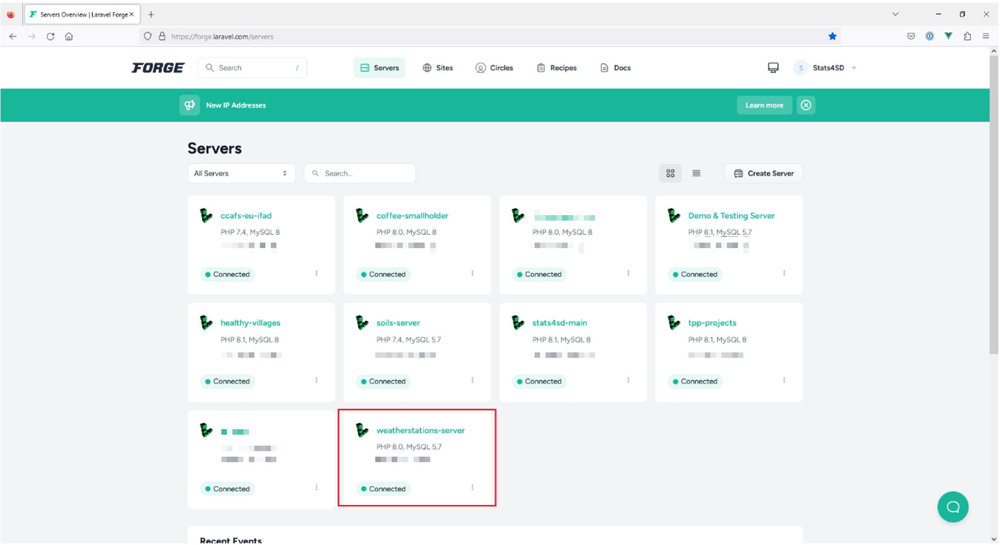

It shows all sites under this server. Click “New Site” to create a new site.

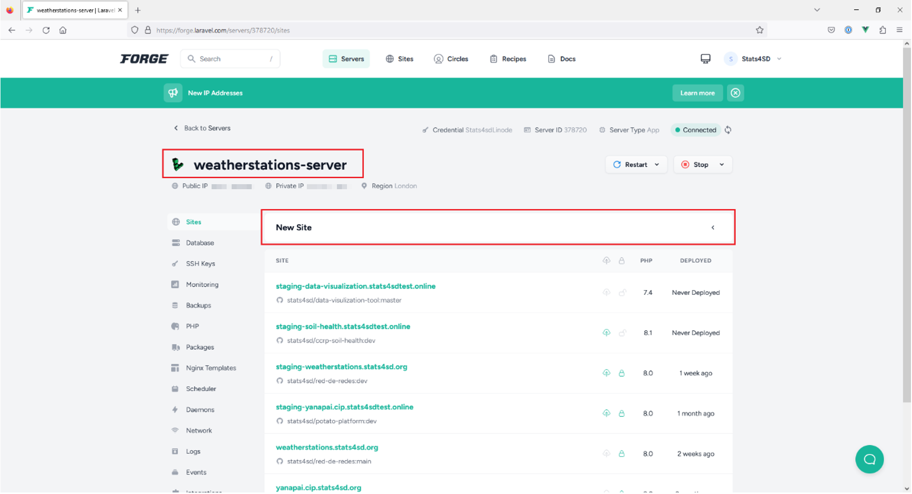

Fill in details for below fields:

- “Root Domain”, fill in “staging-soil-health.stats4sdtest.online”
- “PHP Version”, select the appropriate PHP version for your application. E.g., PHP 8.1
- Click “Add” button

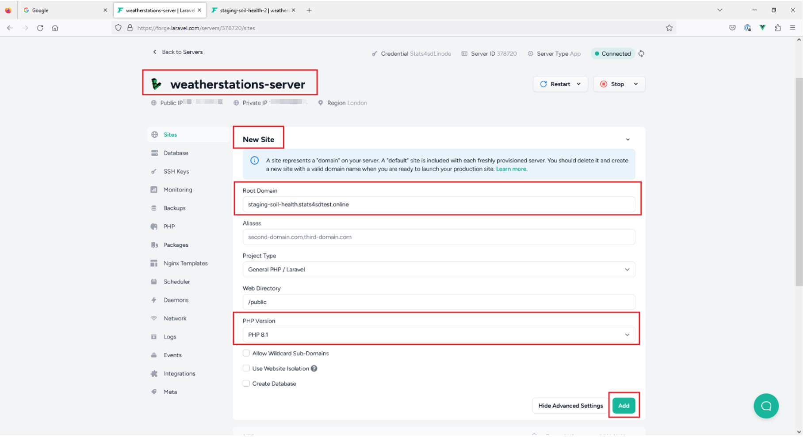

It takes a little while to create your new site:

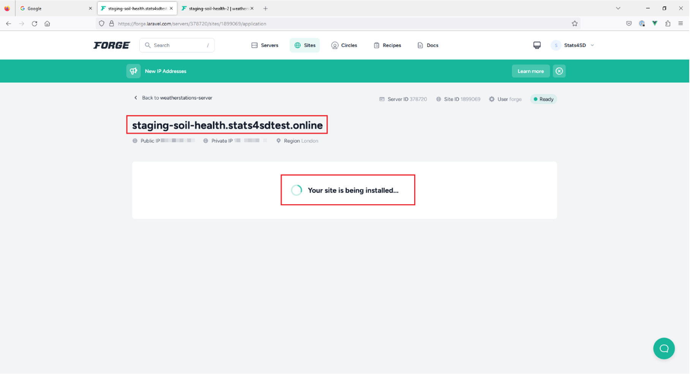

New site “staging-soil-health.stats4sdtest.online” is created.

## Install Application Into the new Site

Click “Git Repository” to select the corresponding GitHub repo for this application.

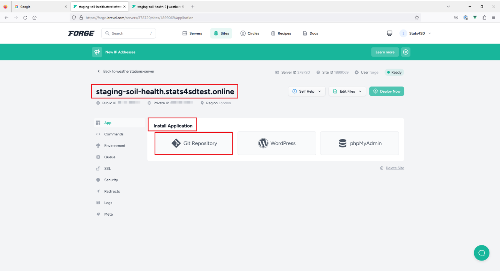

Fill in details for below fields:

- “Repository”: stats4sd/ccrp-soil-health
- “Branch”: select “dev” as dev branch is for staging env
- “Install Composer Dependencies”, tick this checkbox
- Click “Install Repository” button

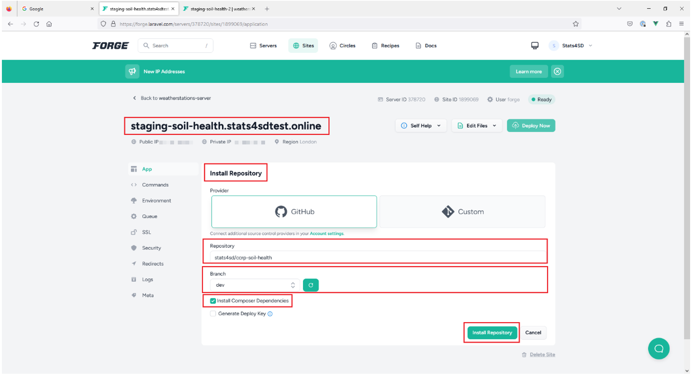

It takes a while for the installation…

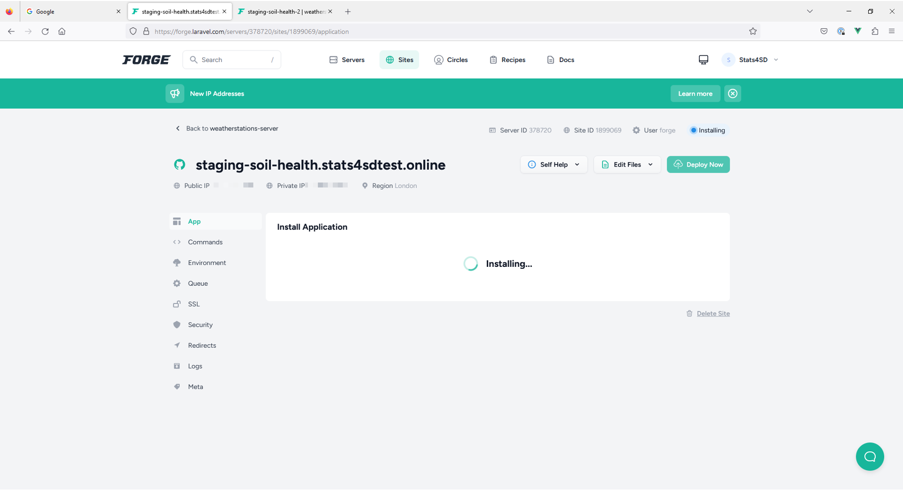

Installation successfully completed. Now we have more items in sidebar menu.

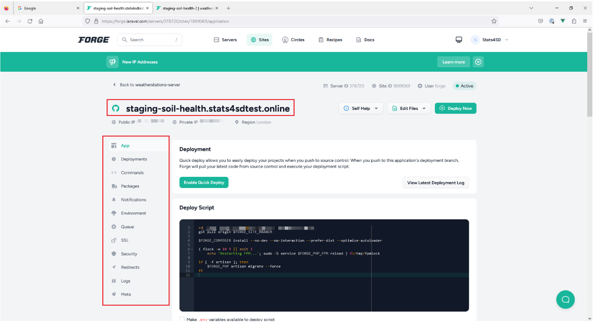

### Modify Deployment

In Deployment section, click “Enable Quick Deploy” button to enable quick deploy feature. Deployment will start automatically when any branch merged into dev branch.

- Do this for Staging environments for quicker testing of updates.
- Do *not* enable this for live environments.

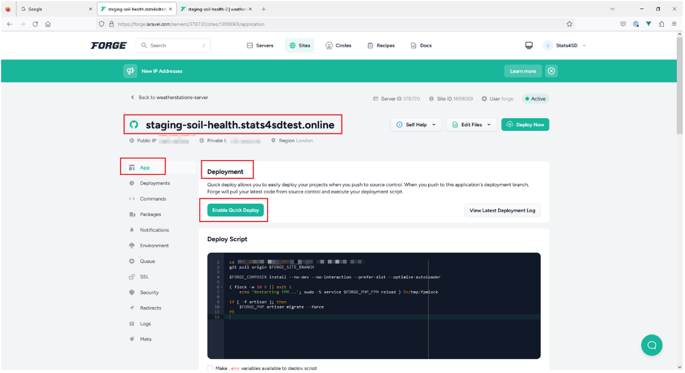

In Deploy Script section, it shows a default deploy script created by Forge.
We will update the deploy script to our own version.
 - Click “Update” button

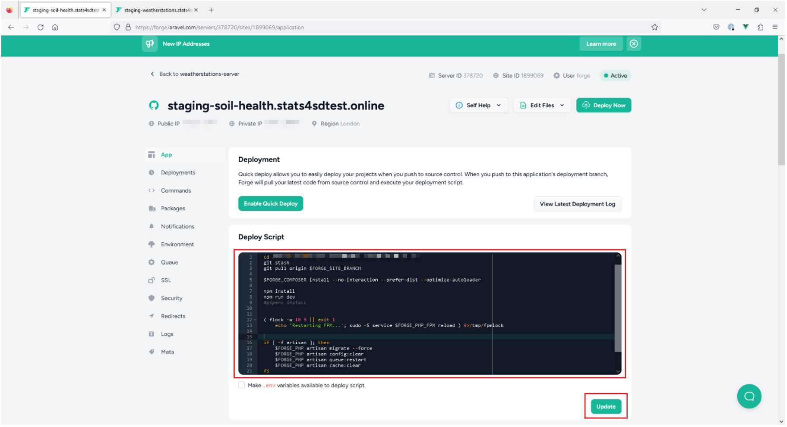

TODO: link to *default* deployment script.

### Setup Environment Variables

In “Environment” tab, an environment file is prepared from .env.example.
Fill in actual values for config items.
Click “Save” button.

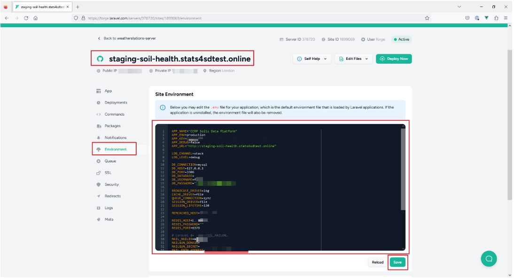

### Setup the Laravel Queue Worker

In “Queue” tab, create a new queue.

- For staging / testing sites, the default values are usually enough.
- For production sites, you may need to change:
  - Number of processes (higher for sites that will get a lot of queued jobs at once)
  - Maximum member (higher for sites that involve processing large datasets, or with need for a lot of concurrent requests)
  - Maximum seconds per job (ideally this should never need to change, but sometimes it's better to increase this instead of spending lots of time optimising scripts)

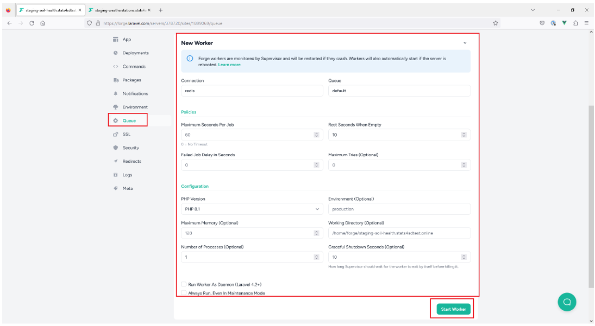

To start the worker, click “Start Worker” button.

A new queue is created successfully. The site can now support queued jobs.

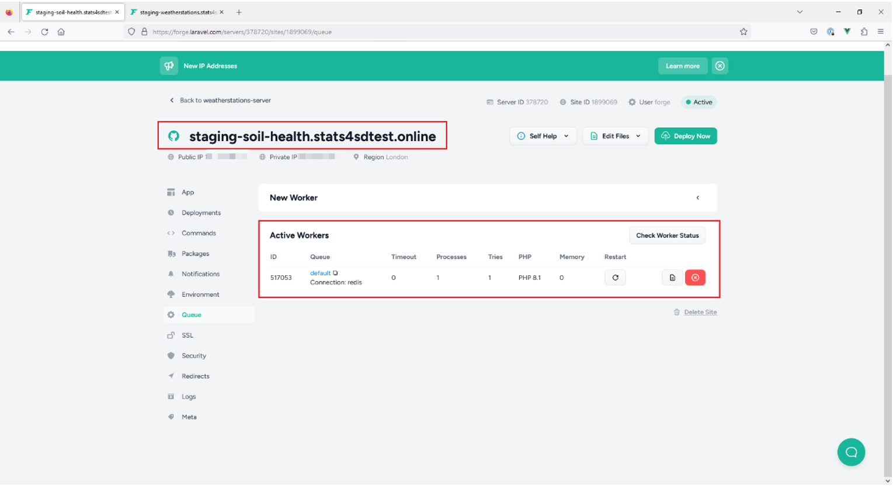

### Install an SSL Certificate

At the site level, on the SSL tab, click "Let's Encrypt", then "Obtain Certificate" to generate a new SSL certificate from that service.

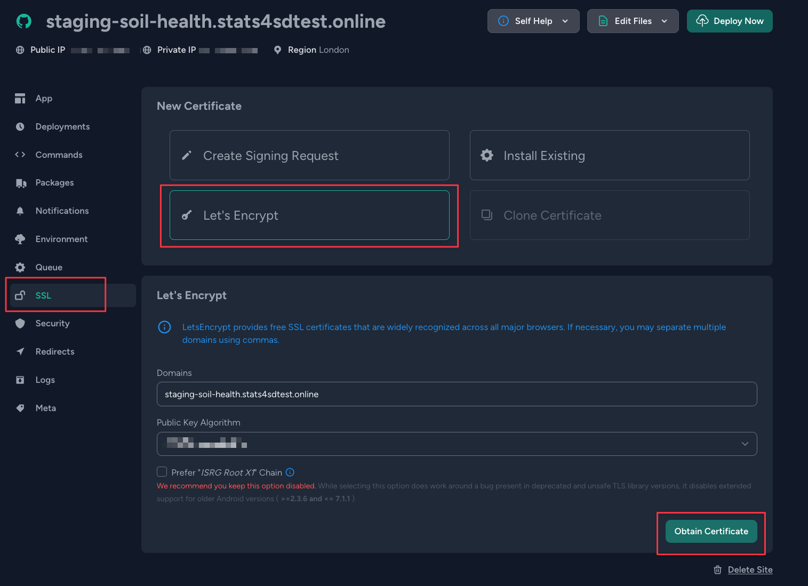

The system will automatically setup a redirect to ensure all traffic is sent via "https" for the site. Once activated, the certificate will appear in the list:

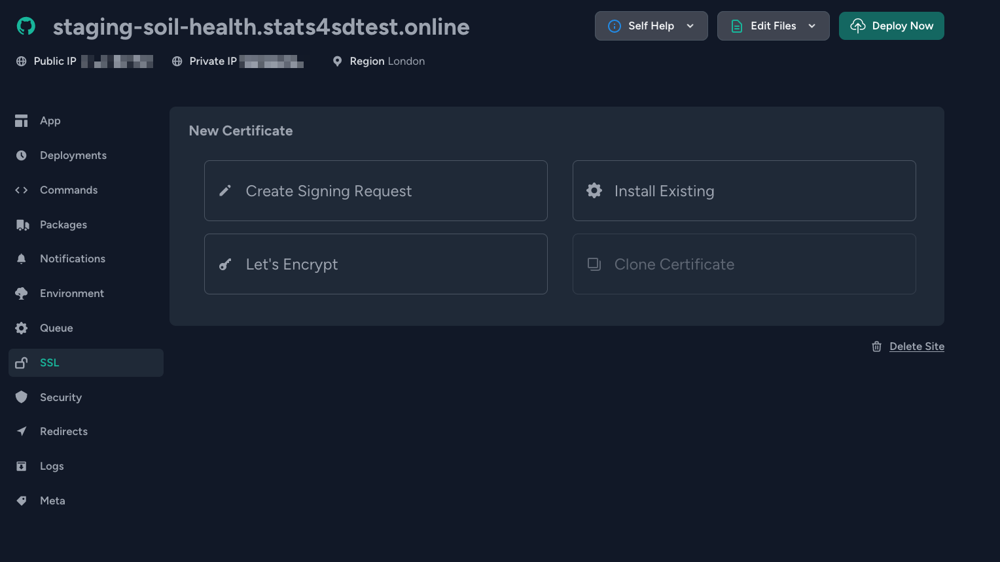

### Setup Scheduler for the site

Go back to server level, click “Scheduler” tab.

Click “New Scheduled Job”

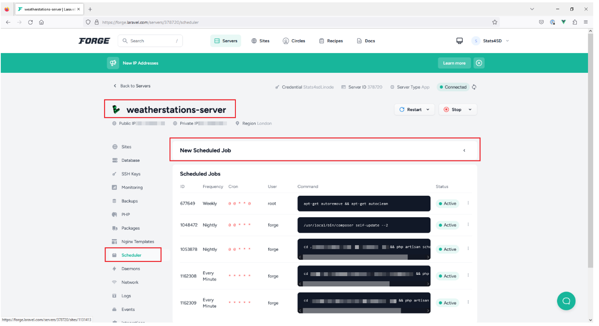

For “Command”, fill in `php /home/forge/staging-soil-health.stats4sdtest.online/artisan schedule:run`

(If the site does *not* use the default PHP version defined for the server, use the appropriate php alias. E.g. `php8.1` or `php7.4`. )
- Leave other fields with default values.
- Click “Create” button

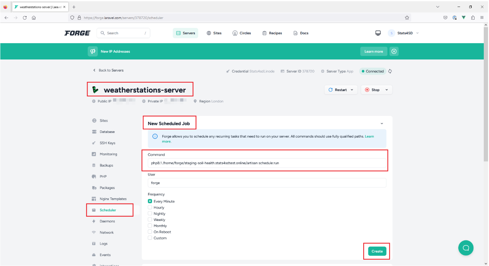

A new scheduled job is created.

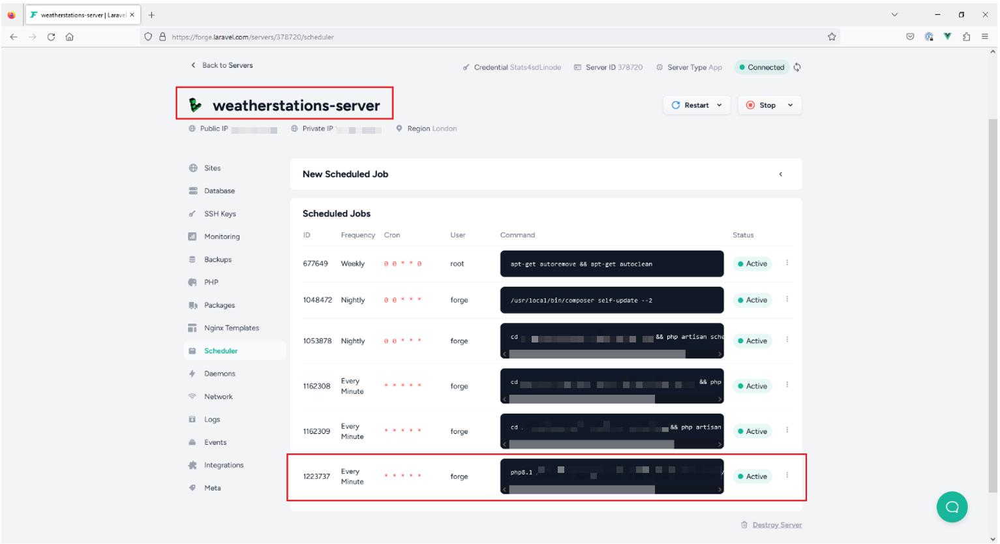

## Optional Extras Via Recipes

### If the Site uses R
If a site uses R, then R must be installed on the server. To do that:

- Go to [recipes](https://forge.laravel.com/recipes) in Laravel Forge and run the `Install R with RMarkdown support (Ubuntu 20.04)` recipe on the site's server.

### If the site requires Laravel Backpack Pro or Spatie Pro Packages
Some of our sites require one of the following paid packages:

 - Laravel Backpack Pro
 - Laravel Backpack Editable Fields
 - Spatie Media Library Pro

To allow these packages to be installed through composer, we must update the server's composer auth.json file. To do this, use the appropriate Forge recipe:

- `Enable Backpack Pro Packages`
- `Enable Spatie Pro Packages`

