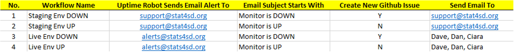
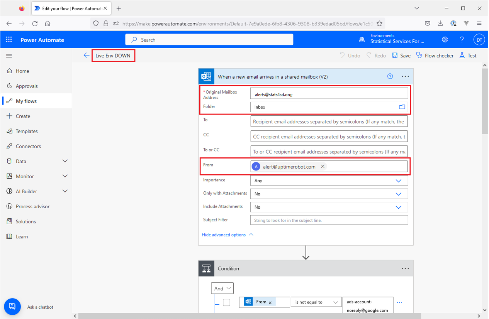
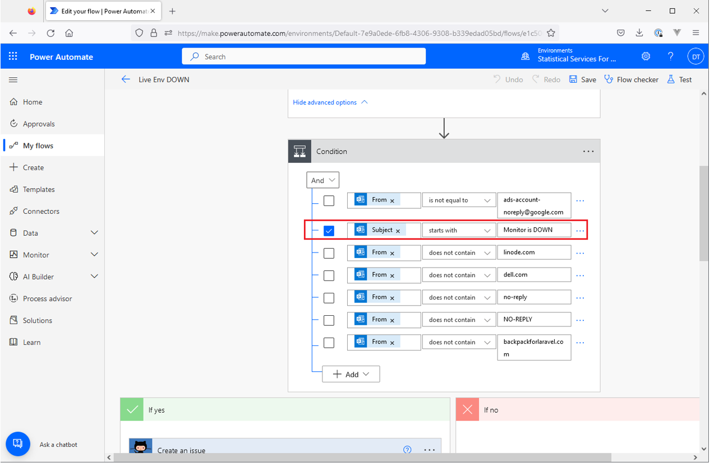
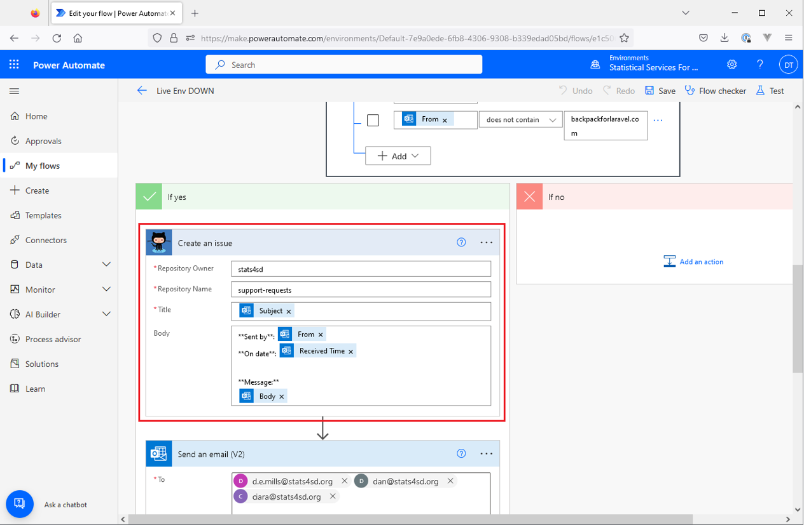
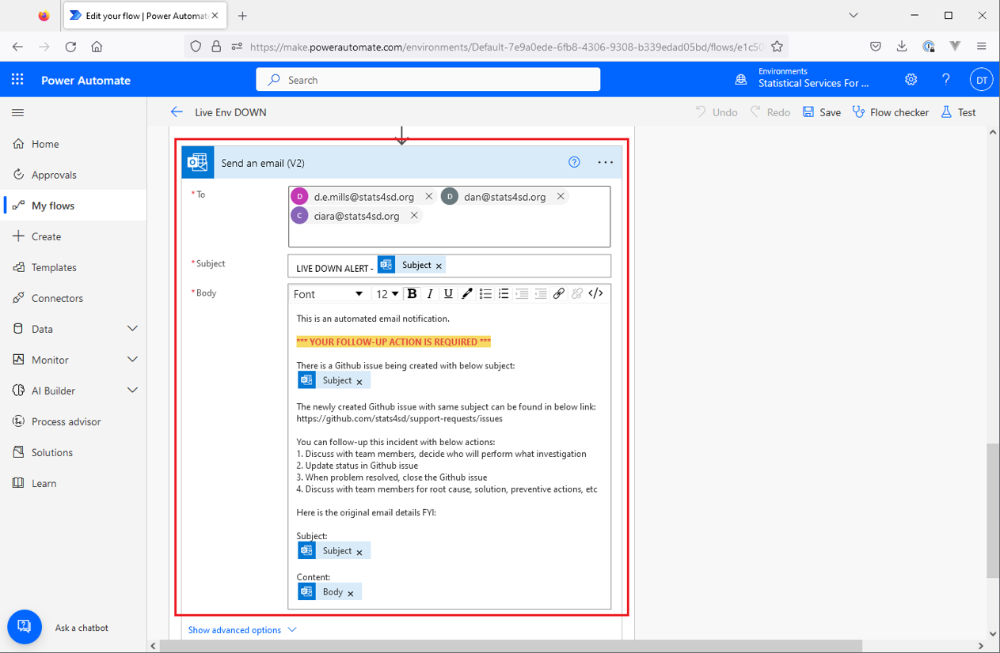

# MS Power Automate Flow

We make use of MS Power Automate flows, to create a new Github issue when a pre-defined email account receives Uptime robot alert email.

For new data platform, it is not necessary to create new flow in MS Power Automate.

Instead, we need to create new monitors for staging env and live env in Uptime Robot.

P.S. In case you need to create a new workflow in MS Power Automate, please kindly contact engineering team members to share the existing flows as your template.

## Uptime Robot Email Alert

We use Uptime robot to monitor our data platforms, simply to check whether it is alive or died.

Uptime robot sends DOWN or UP alert email to a pre-defined email address when the monitored web site is died or alive.

## Company Email Address for Receiving Uptime Robot Email Alert

We configured support@stats4sd.org for STAGING env, and alerts@stats4sd.org for LIVE env.

In case any staging env is died, it is not too urgent to fix.
Email will be sent to support@stats4sd.org. It will be follow-up when any engineering team members check email in support@stats4sd.org.

In case any live data platform is died, it requires our attention to fix it as soon as possible.
Instead of checking email proactively, engineering team members need to be informed passively.

For live env, it is urgent to fix for minimal downtime and impact.
Email will be sent to engineering team members. We will discuss and decide who will perform what investigations. We can keep track the investigation result, root cause, solution, preventive actions etc in the Github issue.

The Github issue can be closed when problem resolved and the related data platform alive again.

## MS Power Automate

We use MS Power Automate to connect all these together as a workflow. 

MS Power Automate allows us to define a workflow and execute it automatically when pre-defined conditions fulfilled.

We have four use cases:
1. When we receive STAGING ENV DOWN email alert from Uptime Robot, creates a new Github issue and send email to support@stats4sd.org
2. When we receive STAGING ENV UP email alert from Uptime Robot, send email to support@stats4sd.org
3. When we receive LIVE ENV DOWN email alert from Uptime Robot, creates a new Github issue and send email to engineering team members
4. When we receive LIVE ENV UP email alert from Uptime Robot, send email to engineering team members

The following excel file screen shots summaries all four use cases:

## MS Power Automate Flow

Here are screen shots for “Live Env Down” flow.

Essential configurations are highlighted in RED.

Conditions to identify Uptime robot monitor email alert:
Email recipient: alerts@stats4sd.org
Email folder: Inbox
Email sender: alert@uptimerobot.com

Conditions to identify Uptime robot monitor email alert:
Tick the required condition:
Subject starts with “Monitor is DOWN”

Create an issue, it means creating a new issue in GitHub

Repository Owner: stats4sd
Repository Name: support-requests
The new Github issue will be created in repository “stats4sd/support-requests”
https://github.com/stats4sd/support-requests/issues

We use some pre-defined fields so that content from original email alert can be added to Github issue. Including [Subject], [From], [Received From], [Body].

Title: [Subject], it is Uptime robot email subject for easy identification

Body:
[From], it is Uptime robot email sender
[Received Time], it is the date time that the Uptime robot email received
[Body], it is Uptime robot email body

Send an email (V2), it means sending email to engineering team members.
To: specify who will receive this email alert. We can define multiple recipients. External email address is also supported.

Subject: LIVE DOWN ALERT – [Subject]
Add prefix “LIVE DOWN ALERT” for categorization, and the original Uptime robot email alert subject

Body:
It contains a few items:
1.	Mention this email is automated generated.
2.	A highlighted message to indicate your follow-up actions is required.
3.	Mention there is a new Github issue being created with quoted subject.
4.	A link that can redirect to the listing of Github issues.
5.	Suggested follow-up actions
6.	Original email alert subject and body for quick reference

## Appendix

### STAGING ENV – MONITOR IS DOWN

1. Uptime Robot sends “Monitor is DOWN” email alert to support@stats4sd.org
2. MS Power Automate receives Uptime Robot “Monitor is DOWN” email alert
3. MS Power Automate creates Github issue in repo “stats4sd/support-requests”
4. MS Power Automate sends email alert to support@stats4sd.org
5. Engineering team members check email alert in support@stsat4sd.org proactively
6. Engineering team members investigate and resolve Github issue

### STAGING ENV – MONITOR IS UP

1. Uptime Robot sends “Monitor is UP” email alert to support@stats4sd.org 
2. MS Power Automate receives Uptime Robot “Monitor is UP” email alert
3. MS Power Automate sends alert email to support@stats4sd.org 
4. Engineering team members check email alert in support@stsat4sd.org proactively

### LIVE ENV – MONITOR IS DOWN

1. Uptime Robot sends “Monitor is DOWN” email alert to alerts@stats4sd.org
2. MS Power Automate receives Uptime Robot “Monitor is DOWN” email alert
3. MS Power Automate creates Github issue in repo “stats4sd/support-requests”
4. MS Power Automate sends email alert to pre-defined engineering team members
5. Engineering team members receive email alert passively
6. Engineering team members investigate and resolve Github issue

### LIVE ENV – MONITOR IS UP

1. Uptime Robot sends “Monitor is UP” email alert to alerts@stats4sd.org
2. MS Power Automate receives Uptime Robot “Monitor is UP” email alert
3. MS Power Automate sends alert email to pre-defined engineering team members
4. Engineering team members receive email alert passively
