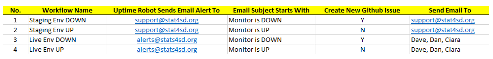
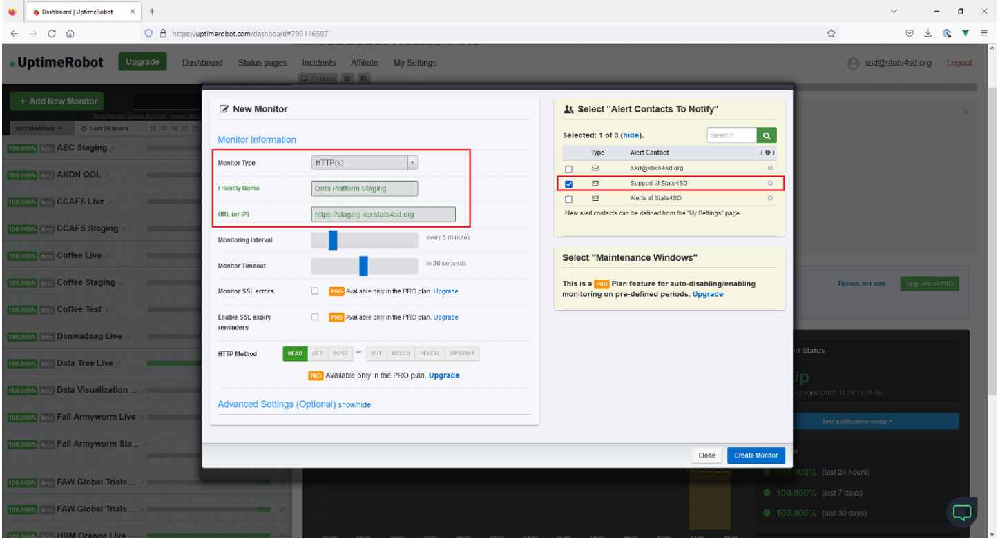
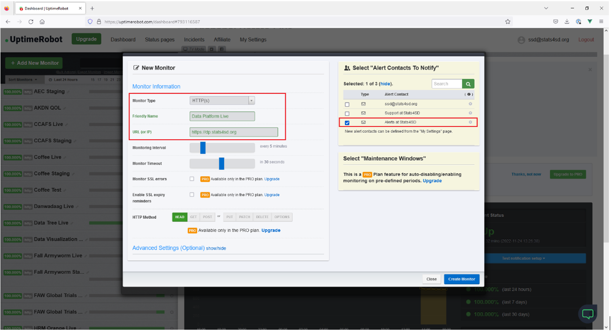
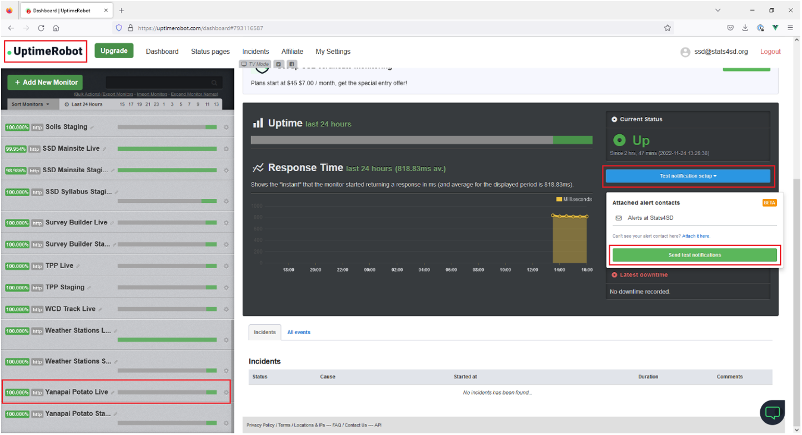
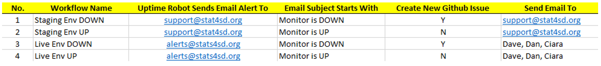
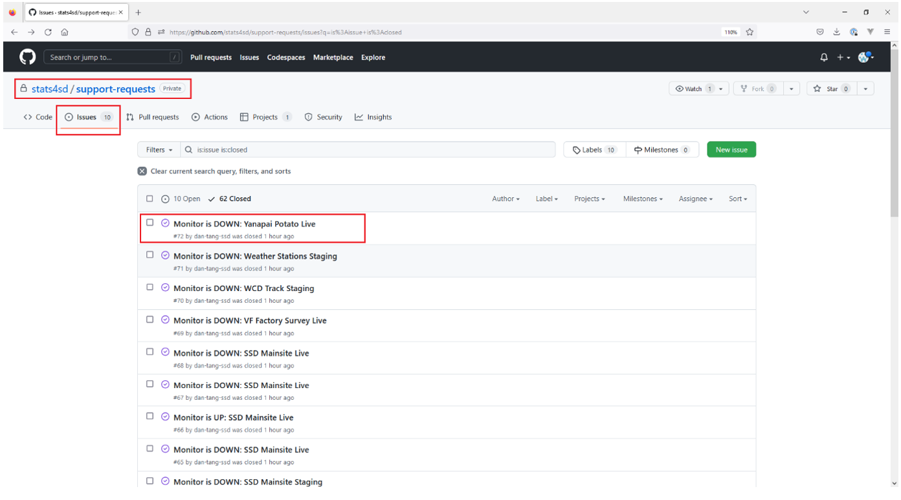
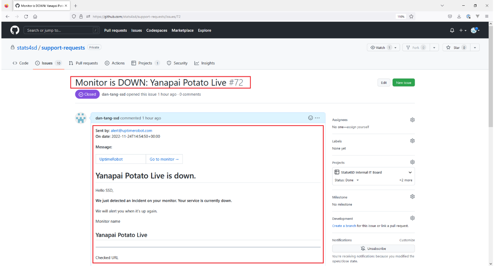
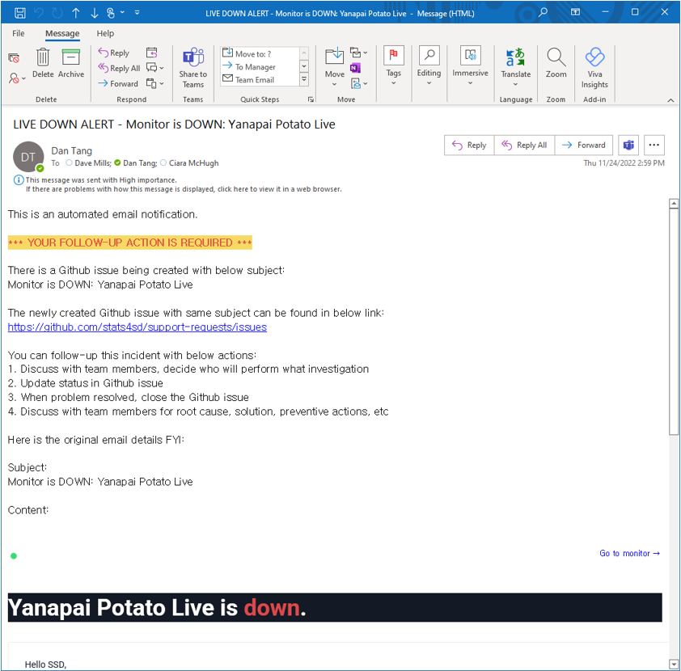
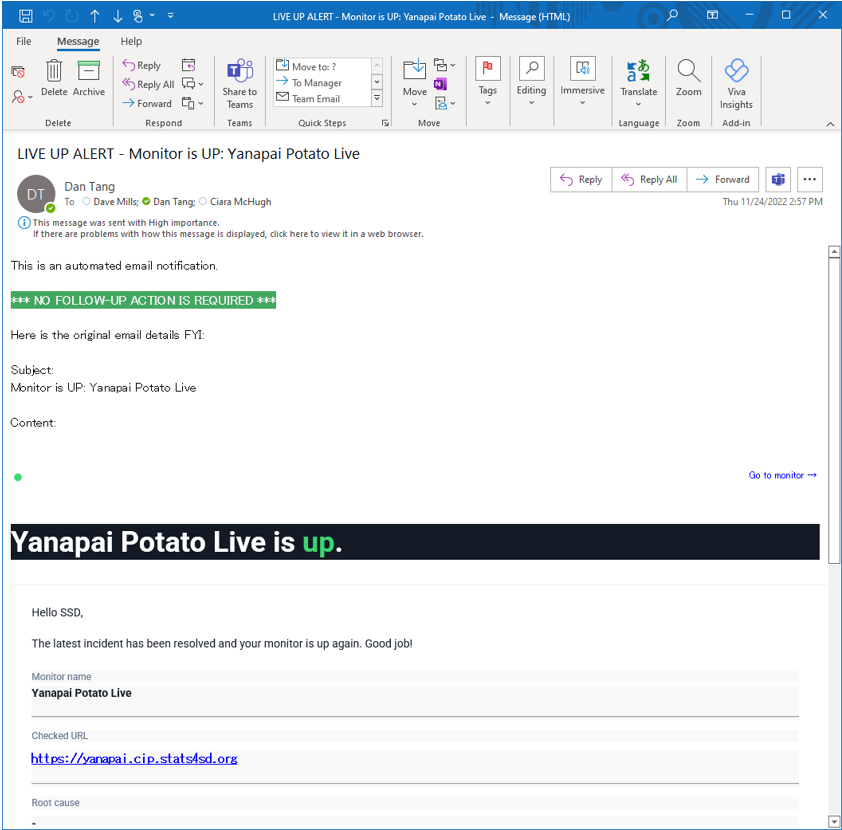

# Uptime Robot Monitor

When we have a new data platform, we need to create new monitors for staging env and live env respectively in Uptime Robot.

Staging env email alert should be sent to support@stats4sd.org.
Live env email alert should be sent to alerts@stats4sd.org.

It is highly recommended to send test notifications after creating new monitor.

## Intro

We use Uptime robot to monitor our data platforms, simply to check whether it is alive or died.
Uptime robot sends DOWN or UP alert email to a pre-defined email address when the monitored web site is died or alive.

## Uptime Robot Email Alert

To discriminate this is alert email for staging env or live env easily. We configured different email address in monitor for staging env and live env.

For staging env, we configure to send alert email to support@stats4sd.org.
For live env, we configure to send alert email to alerts@stats4sd.org.

We have already setup four MS Power Automate Flows to handle below four cases:
1. When we receive STAGING ENV DOWN email alert from Uptime Robot, creates a new Github issue and send email to support@stats4sd.org
2. When we receive STAGING ENV UP email alert from Uptime Robot, send email to support@stats4sd.org
3. When we receive LIVE ENV DOWN email alert from Uptime Robot, creates a new Github issue and send email to engineering team members
4. When we receive LIVE ENV UP email alert from Uptime Robot, send email to engineering team members

The following excel file screen shots summaries all four use cases:

## Uptime Robot Minitor for Staging Env

Note:
1.	In Friendly Name column, add postfix “Staging”
2.	Select “Support at Stats4SD” in Alert Contacts, alert email will be sent to support@stats4sd.org

## Uptime Robot Minitor for Live Env

Note:
1.	In Friendly Name column, add postfix “Live”
2.	Select “Alerts at Stats4SD” in Alert Contacts, alert email will be sent to alerts@stats4sd.org

## Uptime Robot Monitor, Send Test Notification

This is good to perform testing for newly created monitors, so that we can confirm it is working fine when real incident happens.

Below shows how to manual trigger Uptime Robot Monitor to send test notification:

Please send testing notification for Staging env monitor and Live env monitor respectively.

We have four flows in MS Power Automate to handle different email alert with different workflow:

## Github Issue:

Below please find a newly created Github issue:

The Github issue has the same subject as Uptime Robot alert email for easy identification.

It also contain the email sender, date time and original email content for easy reference.

## LIVE DOWN ALERT Email Sent to Engineering Team Members

## LIVE UP ALERT Email Sent to Engineering Team Members

