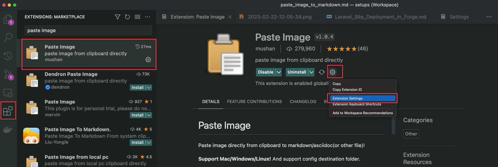

# Markdown in VS Code

## Paste an image as markdown reference

1. Install the Paste Image extension: https://marketplace.visualstudio.com/items?itemName=mushan.vscode-paste-image

2. Go to the extension-specific settings (you can get there by looking at the extension, clicking the cog-wheel and choosing "extension settings")

3. Change the following settings:
   - Paste Image: **Base Path**:
     - `${currentFileDir}/attachments/`
   - Paste Image: **Insert Pattern**:
     - `${imageSyntaxPrefix}attachments/${imageFilePath}${imageSyntaxSuffix}`
   - Paste Image: **Path**:
     - `${currentFileDir}/attachments`

## To Use

- Put an image on your clipboard. (E.g., on Windows, use win + shift + s to take a screenshot of a part of your screen.)
- Put your cursor in a markdown document where you want the image.
- Press ctrl + alt + v.
  - This will copy the image into an `attachments` subfolder, and insert a markdown reference to it. Like so:

``